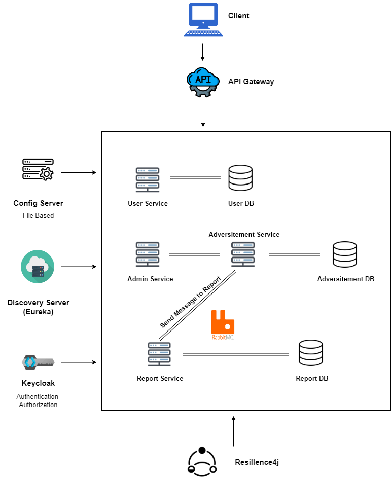
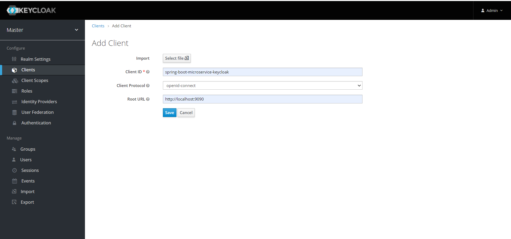
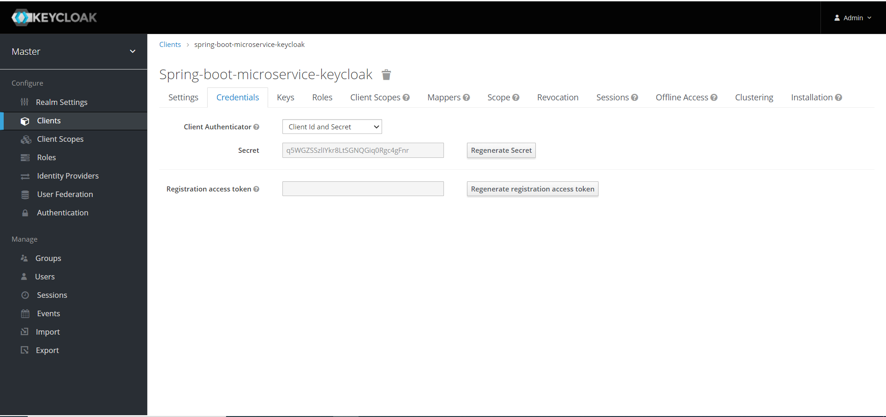
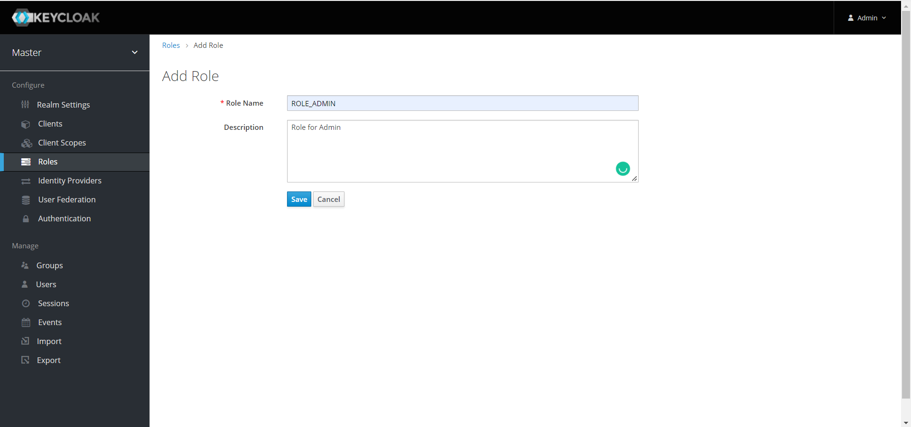

# Exemplo de Microsserviços Spring Boot (Eureka Server, Config Server, API Gateway, Serviços, RabbitMq, Keycloak)

### Esse projeto é parte de um treinamento de Java(2022) utilizando arquitetura em micro-serviços com autenticação, autorização, mensageria e DevOps(Docker) e demais stacks.



# Sobre o projeto

<ul style="list-style-type:disc">
  <li>O usuário pode se registrar e fazer login através do Keycloak</li>
  <li>O administrador pode criar, atualizar, excluir anúncios e obter anúncios por seu ID e obter todos os anúncios do serviço de gerenciamento para o serviço de anúncios através do API Gateway</li>
  <li>O administrador pode aprovar e rejeitar anúncios do serviço de anúncios para o serviço de relatórios usando o serviço de gerenciamento através do API Gateway</li>
  <li>O usuário pode obter anúncios por seu ID e obter todos os anúncios do serviço de gerenciamento para o serviço de anúncios através do API Gateway</li>
  <li>A contagem de visualizações do anúncio aprovado aumenta quando o usuário tenta exibi-lo</li>
</ul>

Sete serviços, cujos nomes são mostrados abaixo, foram projetados dentro do escopo deste projeto.

- Config Server
- Eureka Server
- API Gateway
- Serviço de Usuário
- Serviço de Gerenciamento
- Serviço de Anúncios
- Serviço de Relatórios

### 🔨 Executar o aplicativo

**Docker**

**1 )** Instale o **Docker Desktop**. Aqui está o link de instalação: https://docs.docker.com/docker-for-windows/install/

**2 )** Abra o **Terminal** na pasta **resources** para executar **Keycloak** e **RabbitMq** no contêiner **Docker**
```
    docker-compose up -d
```

**3 )** Implemente as configurações do Keycloak
```
    1 ) Abra o Keycloak no navegador através de localhost:8181
    2 ) Digite o nome de usuário e senha (admin : admin)
    3 ) Crie um cliente chamado spring-boot-microservice-keycloak e defina-o na configuração do Keycloak do serviço de usuário
    4 ) Altere o tipo de acesso do cliente de público para confidencial
    5 ) Obtenha a chave secreta para definir clientSecret na configuração do Keycloak do serviço de usuário
    6 ) Defina as funções para Administrador e Usuário como ROLE_ADMIN e ROLE_USER
```

**4 )** Implemente as configurações do Rabbitmq
```
    1 ) Abra o Rabbitmq no navegador através de http://localhost:15672
    2 ) Digite o nome de usuário e senha (rabbitmq : 123456)
    3 ) Abra a seção Admin na barra de navegação
    4 ) Defina um novo usuário chamado guest e seu nome de usuário, senha (guest : guest, função : administrador), em seguida, dê todas as permissões (Host virtual : "/" , regexp : ".*")
```

**Maven>**

**1 )** Inicie o Keycloak e o Rabbit através do Docker

**2 )** Implemente suas configurações

**3 )** Baixe seu projeto deste link `https://github.com/Rapter1990/SpringBootMicroservices`

**4 )** Vá para o diretório raiz do projeto: `cd SpringBootMicroservices`

**5 )** Crie um arquivo jar através deste comando `mvn clean install`

**6 )** Execute o projeto através deste comando `mvn spring-boot:run`

### Para executar as APIs através do gateway

    1) http://localhost:8600/api/v1/users/signup
    2) http://localhost:8600/api/v1/users/login
    3) http://localhost:8600/api/v1/users/info
    4) http://localhost:8600/api/v1/management/admin_role/create/{user_id}
    5) http://localhost:8600/api/v1/management/admin_role/alladvertisements
    6) http://localhost:8600/api/v1/management/admin_role/alladvertisements/{advertisement_id}
    7) http://localhost:8600/api/v1/management/admin_role/update/{advertisement_id}
    8) http://localhost:8600/api/v1/management/admin_role/delete/{advertisement_id}
    9) http://localhost:8600/api/v1/management/admin_role/advertisement/{advertisement_id}/approve
    10) http://localhost:8600/api/v1/management/admin_role/advertisement/{advertisement_id}/reject
    11) http://localhost:8600/api/v1/management/user_role/alladvertisements
    12) http://localhost:8600/api/v1/management/user_role/advertisement/{advertisement_id}

Explore as APIs Rest

<table style="width:100%">
  <tr>
      <th>Método</th>
      <th>Url</th>
      <th>Descrição</th>
      <th>Corpo da Solicitação Válido</th>
      <th>Parâmetros de Solicitação Válidos</th>
      <th>Parâmetros de Solicitação e Corpo Válidos</th>
      <th>Sem Solicitação ou Parâmetros</th>
  </tr>
  <tr>
      <td>POST</td>
      <td>signup</td>
      <td>Cadastre-se para Usuário e Administrador</td>
      <td><a href="README.md#signup">Info</a></td>
      <td></td>
      <td></td>
      <td></td>
  </tr>
  <tr>
      <td>POST</td>
      <td>login</td>
      <td>Login</td>
      <td><a href="README.md#login">Info</a></td>
      <td></td>
      <td></td>
      <td></td>
  </tr>
  <tr>
      <td>GET</td>
      <td>info</td>
      <td>Obtenha informações sobre a função do usuário (ROLE_USER ou ROLE_ADMIN)</td>
      <td></td>
      <td></td>
      <td></td>
      <td><a href="README.md#info">Info</a></td>
  </tr>
  <tr>
     <td>POST</td>
     <td>create/{user_id}</td>
     <td>Crie um anúncio para o usuário</td>
     <td></td>
     <td></td>
     <td><a href="README.md#create">Info</a></td>
     <td></td>
  </tr>
  <tr>
      <td>GET</td>
      <td>alladvertisements</td>
      <td>Obtenha todos os anúncios do Administrador</td>
      <td></td>
      <td></td>
      <td></td>
      <td><a href="README.md#alladvertisementsFromAdmin">Info</a></td>
  </tr>
  <tr>
      <td>GET</td>
      <td>alladvertisements/{advertisement_id}</td>
      <td>Obtenha o anúncio pelo ID do Administrador</td>
      <td></td>
      <td><a href="README.md#advertisementById">Info</a></td>
      <td></td>
      <td></td>
  </tr>
  <tr>
      <td>PUT</td>
      <td>update/{advertisement_id}</td>
      <td>Atualize o anúncio pelo ID</td>
      <td></td>
      <td></td>
      <td><a href="README.md#update">Info</a></td>
      <td></td>
  </tr>
  <tr>
      <td>DELETE</td>
      <td>delete/{advertisement_id} </td>
      <td>Exclua o anúncio pelo ID</td>
      <td></td>
      <td><a href="README.md#delete">Info</a></td>
      <td></td>
      <td></td>
  </tr>
  <tr>
      <td>GET</td>
      <td>advertisement/{advertisement_id}/approve</td>
      <td>Aprovar anúncio por ID</td>
      <td></td>
      <td><a href="README.md#approve">Info</a></td>
      <td></td>
      <td></td>
  </tr>
  <tr>
      <td>GET</td>
      <td>advertisement/{advertisement_id}/reject</td>
      <td>Rejeitar anúncio por ID</td>
      <td></td>
      <td><a href="README.md#reject">Info</a></td>
      <td></td>
      <td></td>
  </tr>
  <tr>
      <td>GET</td>
      <td>alladvertisements</td>
      <td>Obtenha todos os anúncios do Usuário</td>
      <td></td>
      <td></td>
      <td></td>
      <td><a href="README.md#alladvertisementsFromUser">Info</a></td>
  </tr>
  <tr>
      <td>GET</td>
      <td>alladvertisements</td>
      <td>alladvertisements/{advertisement_id}</td>
      <td></td>
      <td></td>
      <td></td>
      <td><a href="README.md#advertisementByIdFromUser">Info</a></td>
  </tr>
</table>

### Dependências Utilizadas

* Core
  * Spring
    * Spring Boot
    * Spring Security
    * Spring Web
      * RestTemplate
    * Spring Data
      * Spring Data JPA
    * Spring Cloud
      * Spring Cloud Gateway Server
      * Spring Cloud Config Server
      * Spring Cloud Config Client
  * Netflix
    * Eureka Server
    * Eureka Client
* Banco de Dados
  * Mysql
* Corretor de Mensagens
  * RabbitMQ
* Segurança
  * Keycloak Server
  * Keycloak OAuth2
  * Keycloak REST API

## Corpo da Solicitação Válido

##### <a id="signup">Cadastre-se para Usuário e Administrador

```
    http://localhost:8600/api/v1/users/signup

    {
        "username" : "springbootmicroserviceuser",
        "password" : "user123456",
        "name" : "Micro User",
        "surname" : "User Surname",
        "phoneNumber" : "123456789",
        "email" : "springbootmicroserviceuser@user.com",
        "role" : "ROLE_USER"
    }

    http://localhost:8600/api/v1/users/signup

    {
        "username" : "springbootmicroserviceadmin",
        "password" : "admin123456",
        "name" : "Micro Admin",
        "surname" : "Admin Surname",
        "phoneNumber" : "123456789",
        "email" : "springbootmicroserviceadmin@admin.com",
        "role" : "ROLE_ADMIN"
    }
```

##### <a id="login">Login

```
    http://localhost:8600/api/v1/users/login
    Bearer Token : Access Token do usuário do Keycloak
    {
        "username" : "springbootmicroserviceuser",
        "password" : "user123456"
    }

    http://localhost:8600/api/v1/users/login
    Bearer Token : Access Token do Administrador do Keycloak
    {
        "username" : "springbootmicroserviceadmin",
        "password" : "admin123456"
    }
```

## Parâmetros de Solicitação Válidos

##### <a id="advertisementById">Obtenha o anúncio pelo ID do Administrador

```
    http://localhost:8600/api/v1/management/admin_role/alladvertisements/{advertisement_id}
    Bearer Token : Access Token do Administrador do Keycloak
```

##### <a id="delete">Exclua o anúncio pelo ID

```
    http://localhost:8600/api/v1/management/admin_role/delete/{advertisement_id}
    Bearer Token : Access Token do Administrador do Keycloak
```

##### <a id="approve">Aprovar anúncio por ID

```
    http://localhost:8600/api/v1/management/admin_role/advertisement/{advertisement_id}/approve
    Bearer Token : Access Token do Administrador do Keycloak
```

##### <a id="reject">Rejeitar anúncio por ID

```
    http://localhost:8600/api/v1/management/admin_role/advertisement/{advertisement_id}/reject
    Bearer Token : Access Token do Administrador do Keycloak
```

##### <a id="advertisementByIdFromUser">Obtenha o anúncio pelo ID do Usuário

```
    http://localhost:8600/api/v1/management/user_role/alladvertisements/{advertisement_id}
    Bearer Token : Access Token do Administrador do Keycloak
```

## Parâmetros de Solicitação e Corpo Válidos

##### <a id="create">Crie um anúncio para o usuário

```
    http://localhost:8600/api/v1/management/admin_role/create/{user_id}
    Bearer Token : Access Token do Keycloak
    {
        "title" : "Advertisement 1 for User 1",
        "price" : 200
    }
```

##### <a id="update">Crie a rota pelo ID da cidade e ID da cidade de destino

```
    http://localhost:8600/api/v1/management/admin_role/update/{advertisement_id}
    Bearer Token : Access Token do Keycloak
    {
        "title" : "Advertisement 1 for User 1 Updated",
        "price" : 300
    }
```

## Sem Solicitação ou Parâmetros

##### <a id="info"> Obtenha informações sobre a função do usuário (ROLE_USER ou ROLE_ADMIN)

```
    http://localhost:8600/api/v1/users/info
    Bearer Token : Access Token do Administrador ou Usuário do Keycloak
```

##### <a id="alladvertisementsFromAdmin"> Obtenha todos os anúncios do Administrador

```
    http://localhost:8600/api/v1/management/admin_role/alladvertisements
    Bearer Token : Access Token do Administrador do Keycloak
```

##### <a id="advertisementByIdFromUser"> Obtenha todos os anúncios do Usuário

```
    http://localhost:8600/api/v1/management/user_role/alladvertisements
    Bearer Token : Access Token do Usuário do Keycloak
```

### Capturas de Tela

<details>
<summary>Clique aqui para mostrar as capturas de tela do projeto</summary>
    <p> Figura 1 </p>
    
    <p> Figura 2 </p>
    
    <p> Figura 3 </p>
    
    <p> Figura 4 </p>
    
    <p> Figura 5 </p>
    
    <p> Figura 6 </p>
    
    <p> Figura 7 </p>
    
    <p> Figura 8 </p>
    
    <p> Figura 9 </p>
    